# agent-skills

Personally curated [Agent Skills](https://agentskills.io/) and subagents for Cursor, Claude Code, VS Code, and Codex.

https://github.com/smith-xyz/agent-skills

## Mental model

| Layer | Use for |
| ----- | ------- |
| Skills (`shared/skills/<name>/`) | Workflows, conventions, and patterns. Invoke with `/skill-name` or let agent auto-apply. |
| Agents (`shared/agents/*.md`) | Separate context, optional `readonly`. Delegated work with their own context window. |

Skills hold the substance; agents delegate bounded tasks. All skills use `disable-model-invocation: true` for explicit-only invocation unless they should auto-apply (e.g. language patterns).

## Layout

```
shared/                      Portable content (works across all vendors)
  skills/<name>/               SKILL.md + scripts, references, assets
  agents/*.md                  Subagent definitions (model_tier, rendered per vendor)
  rules/global.md              Canonical global rules (rendered per vendor)
  mcp/mcp.json                 Canonical MCP server config (rendered per vendor)
  hooks/                       Portable hook scripts
  scheduling/                  launchd/crontab templates

vendors/                     Vendor-specific config
  cursor/
    permissions.json             IDE terminal + MCP allowlists
    cli-config.json              CLI allow/deny (Shell, Read, Write, Mcp)
  claude/
    settings.json                Permissions (allow/deny/ask), model selection
  codex/
    config.toml                  Model, sandbox mode
    rules/default.rules          Starlark execpolicy (allow/deny/prompt)
  vscode/
    settings.json                Terminal auto-approve, sandbox, permissions

scripts/                     Installers + renderers
```

### MCP Servers

Canonical config: `shared/mcp/mcp.json`. Rendered per vendor on install.

| Server | Source | Provides |
| ------ | ------ | -------- |
| GitHub | Official (31k stars, GA) | PRs, issues, CI, notifications, projects |
| Atlassian | Official (GA) | Jira issues, search, OAuth auth |
| DigitalOcean | Official (DO Labs) | Droplets, App Platform, DNS, databases |
| Kubernetes | OSS (Red Hat-adjacent) | Cluster access, pods, logs. `--read-only` mode. |
| Context7 | Community (Upstash) | Version-specific library docs lookup |
| Terraform | Official (HashiCorp) | Registry docs, provider schemas. Docker install. |
| AWS | Official (preview) | Any AWS API, sandboxed scripts, doc search |

### Per-vendor install targets

| Asset | Cursor | Claude Code | Codex | VS Code |
| ----- | ------ | ----------- | ----- | ------- |
| MCP | `~/.cursor/mcp.json` | `~/.claude.json` (merged) | `~/.codex/config.toml` | `~/.vscode/mcp.json` |
| Rules | `~/.cursor/rules/global.mdc` | `~/.claude/CLAUDE.md` | `~/.codex/AGENTS.md` | `~/.copilot/instructions/global.instructions.md` |
| Permissions | `~/.cursor/permissions.json` + `cli-config.json` | `~/.claude/settings.json` | `~/.codex/config.toml` + `rules/*.rules` | VS Code `settings.json` (merged) |
| Skills | `~/.cursor/skills/` | `~/.claude/skills/` | `~/.codex/skills/` | — |
| Agents | `~/.cursor/agents/` | `~/.claude/agents/` | `~/.codex/agents/` | `~/.copilot/agents/` |
| Hooks | `~/.cursor/hooks/` | `~/.claude/hooks/` | `~/.codex/hooks/` | — |

### Skills (explicit invocation)

| Skill | Purpose |
| ----- | ------- |
| `coding-practice` | Generate no-AID coding practice sessions |
| `commit-prep` | Branch name, conventional commit message, PR body from staged changes |
| `ghsa-triage` | Fetch/cluster GitHub Security Advisories; validate with sink evidence; opt-in adversarial pass |
| `morning-briefing` | Morning digest via GitHub/Atlassian MCP + transcript history |
| `orchestrate` | Generic project loop — DAG, dispatch, verify, iterate |
| `project-triage` | Issue/PR triage pipeline — labels, backlog plans, PR scoring |
| `sniff-bugs` | Hunt logic gaps, error-path holes, leaks, concurrency, observability misses |
| `triage` | Issue/PR triage via GitHub MCP — score, classify, render reports |
| `verify-gate` | Composable hook helper for post-turn compile/lint/test verification |
| `work-review` | Summarize work from transcripts; optional Jira mapping |

### Skills (auto-apply by agent)

| Skill | Purpose |
| ----- | ------- |
| `go-patterns` | Go conventions, errors, concurrency |
| `python-patterns` | Python OOP, pydantic, type hints |
| `react-patterns` | React components, hooks, providers |
| `rust-patterns` | Rust modules, error handling, traits |
| `typescript-patterns` | TypeScript strict types, async, DI |
| `openshift-debug` | OpenShift cluster debugging |
| `pr-comments` | Fetch PR review comments (human + bots); Qodo/CodeRabbit notes |
| `arxiv-ai-scan` | arXiv paper search |

## Skill Map

```mermaid
graph TD
  subgraph explicit [Skills — explicit invocation]
    coding_practice["coding-practice"]
    commit_prep["commit-prep"]
    ghsa_triage["ghsa-triage"]
    morning_briefing["morning-briefing"]
    orchestrate["orchestrate"]
    project_triage["project-triage"]
    sniff_bugs["sniff-bugs"]
    triage["triage"]
    verify_gate["verify-gate"]
    work_review["work-review"]
  end
  subgraph auto [Skills — auto-apply]
    arxiv_ai_scan["arxiv-ai-scan"]
    go_patterns["go-patterns"]
    openshift_debug["openshift-debug"]
    python_patterns["python-patterns"]
    pr_comments["pr-comments"]
    react_patterns["react-patterns"]
    rust_patterns["rust-patterns"]
    typescript_patterns["typescript-patterns"]
  end
  subgraph mcp [MCP Servers]
    GitHub["GitHub MCP"]
    Atlassian["Atlassian MCP"]
    DigitalOcean["DigitalOcean MCP"]
    Kubernetes["Kubernetes MCP"]
    Context7["Context7 MCP"]
    Terraform["Terraform MCP"]
    AWS["AWS MCP"]
  end
  subgraph agents_graph [Agents]
    agent_code_complexity(["code-complexity ⓡ"])
    agent_defender(["defender ⓡ"])
    agent_go_dev["go-dev"]
    agent_impact_repro(["impact-repro ⓡ"])
    agent_openshift_debug(["openshift-debug ⓡ"])
    agent_orchestrator["orchestrator"]
    agent_python_dev["python-dev"]
    agent_react_dev["react-dev"]
    agent_red_team(["red-team ⓡ"])
    agent_researcher(["researcher ⓡ"])
    agent_rust_dev["rust-dev"]
    agent_security_assess(["security-assess ⓡ"])
    agent_typescript_dev["typescript-dev"]
    agent_verifier(["verifier ⓡ"])
    agent_work_review(["work-review ⓡ"])
  end
  morning_briefing -.-> work_review
  orchestrate --> agent_researcher
  orchestrate --> agent_verifier
  orchestrate -.-> sniff_bugs
  ghsa_triage --> agent_security_assess
  ghsa_triage --> agent_impact_repro
  ghsa_triage --> agent_code_complexity
  ghsa_triage -.-> agent_red_team
  ghsa_triage -.-> agent_defender
  ghsa_triage -->|"advisory fetch via"| GitHub
  project_triage -->|"issue/PR fetch via"| GitHub
  react_patterns -.-> typescript_patterns
  sniff_bugs -.-> go_patterns
  sniff_bugs -.-> python_patterns
  sniff_bugs -.-> rust_patterns
  sniff_bugs -.-> typescript_patterns
  typescript_patterns -.-> react_patterns
  verify_gate --> agent_verifier
  agent_go_dev --> go_patterns
  agent_openshift_debug --> openshift_debug
  agent_orchestrator --> orchestrate
  agent_python_dev --> python_patterns
  agent_react_dev --> react_patterns
  agent_react_dev --> typescript_patterns
  agent_rust_dev --> rust_patterns
  agent_typescript_dev --> react_patterns
  agent_typescript_dev --> typescript_patterns
  agent_work_review --> work_review
  morning_briefing -->|"GH queries via"| GitHub
  morning_briefing -->|"Jira queries via"| Atlassian
  triage -->|"issue/PR fetch via"| GitHub
  openshift_debug -->|"cluster access via"| Kubernetes
  orchestrate -->|"task source via"| GitHub
```

<!-- BEGIN SKILL MAP -->

<!-- END SKILL MAP -->

## Installation

```bash
git clone git@github.com:smith-xyz/agent-skills.git
cd agent-skills
make install-deps      # once: brew install gh jq openshift-cli
make install-cursor    # or: install-claude, install-codex, install-vscode
make remove-cursor     # uninstall
```

Each vendor has its own script at `scripts/install-<vendor>.sh`. Shared content (rules, MCP) renders from canonical sources via `scripts/render-*.sh`.

After install, set env vars: `GITHUB_PERSONAL_ACCESS_TOKEN`, `DIGITALOCEAN_API_TOKEN`, AWS creds.

### Permissions

Each vendor has its own permission model. Source files live in `vendors/<vendor>/`:

| Vendor | File | Controls |
| ------ | ---- | -------- |
| Cursor | `permissions.json` | IDE terminal + MCP auto-run allowlists |
| Cursor | `cli-config.json` | CLI agent allow/deny (`Shell`, `Read`, `Write`, `Mcp`) |
| Claude | `settings.json` | Command permissions (allow/deny/ask), model selection |
| Codex | `config.toml` | Model, sandbox mode |
| Codex | `rules/default.rules` | Starlark execpolicy (allow/deny/prompt per command) |
| VS Code | `settings.json` | Terminal auto-approve (regex), sandbox, permission level |

### VS Code cross-vendor detection

VS Code natively reads `CLAUDE.md`, `AGENTS.md`, and `.claude/agents/`. The VS Code installer detects existing rules and agents from Claude or Codex installs and skips duplicating them. It only installs its own unique pieces (MCP in VS Code format, `settings.json` merge). If no other vendor is installed, rules go to `~/.copilot/instructions/` and agents to `~/.copilot/agents/`.
