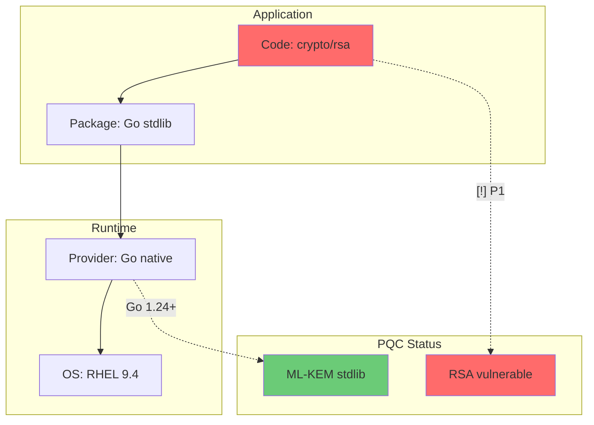
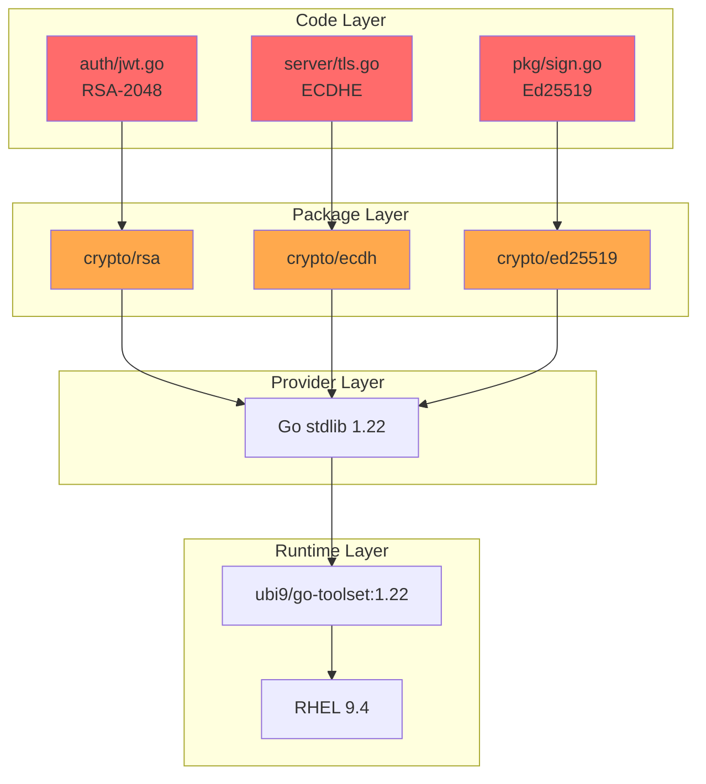
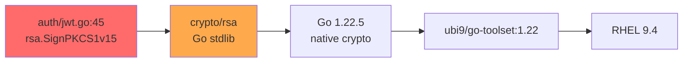
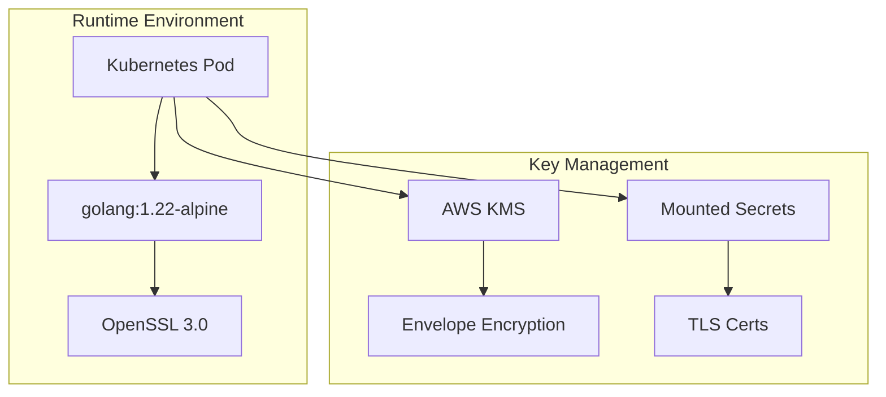
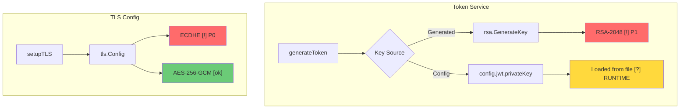
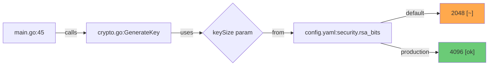
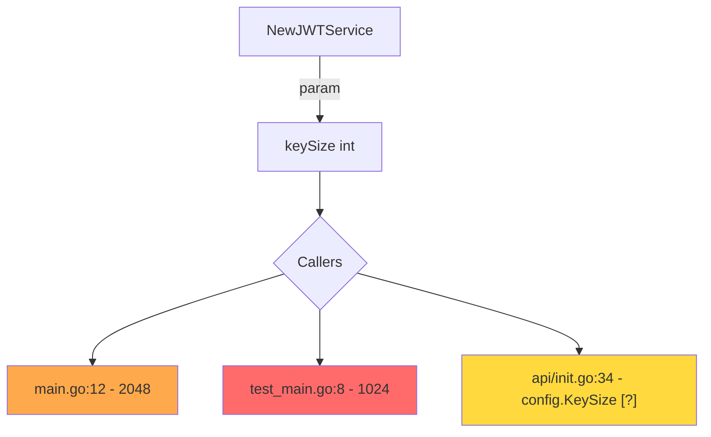

# Report Templates

Report templates showing the complete dependency chain.

## Report Structure

```markdown
# PQC Readiness Report

Generated: [timestamp]
Model: [model name/version used for analysis]
Codebase: [path]

## Crypto Stack Diagram

[Include Mermaid diagram showing the dependency chain]



## Environment

| Layer | Value | Source |
| ----- | ----- | ------ |
| Language | Go 1.22.5 | go.mod |
| Build Image | registry.access.redhat.com/ubi9/go-toolset:1.22 | Dockerfile |
| Runtime Image | registry.access.redhat.com/ubi9/ubi-minimal:9.4 | Dockerfile |
| OS | RHEL 9.4 | Base image |
| Crypto Provider | Go native (no CGO) | go env CGO_ENABLED=0 |
| OpenSSL | N/A (Go native) | - |
| FIPS Mode | Disabled | No GODEBUG=fips140 |

## PQC Support at Each Layer

| Layer | ML-KEM (Kyber) | ML-DSA (Dilithium) | Notes |
| ----- | -------------- | ------------------ | ----- |
| Go 1.22 | No | No | ML-KEM in 1.24+, ML-DSA not yet |
| RHEL 9.4 | No | No | Waiting on OpenSSL 3.2+ |
| Available Now | Via circl | Via circl | Third-party library |

## Summary

| Priority | Count | Status |
| -------- | ----- | ------ |
| P0 (Key Exchange) | X | [!] Migrate |
| P1 (Signatures) | X | [~] Plan |
| P2 (Symmetric) | X | [i] Track |
| Safe | X | [ok] |

## Protocol Overview

| Protocol | Role | Count | TLS | PQC Impact |
| -------- | ---- | ----- | --- | ---------- |
| HTTP | Server | 2 | Yes | P0 - Key exchange |
| HTTP | Client | 4 | Yes | P0 - Key exchange |
| gRPC | Server | 1 | mTLS | P0 + P1 (certs) |
| SSH | Client | 1 | Yes | P1 - Host keys |
| Database | Client | 1 | Yes | P0 - Key exchange |

### Migration Order

1. **Servers first** - Must support hybrid mode during transition
2. **Clients after** - Upgrade once servers support PQC
3. **mTLS** - Requires both key exchange and cert updates

## Findings

[Detailed findings with full stack - see Finding Template below]

## Full Dependency Graph

[Mermaid diagram showing all crypto dependencies across the codebase]



## Migration Recommendations

[Algorithm-specific guidance]

## Finding Template - Full Stack

```markdown
## Finding: pkg/auth/jwt.go:45

**What:** RSA-2048 signature for JWT tokens
**Usage:** Token signing in AuthService.GenerateToken()

### Dependency Chain

| Layer | Value | PQC Status |
| ----- | ----- | ---------- |
| Code | `rsa.SignPKCS1v15()` | Refactor to ML-DSA |
| Package | `crypto/rsa` (stdlib) | No PQC yet |
| Go Version | 1.22.5 | ML-KEM in 1.24+, ML-DSA not yet |
| Build Image | ubi9/go-toolset:1.22 | Update when 1.24 available |
| Runtime | RHEL 9.4 | Go native, no OS crypto dep |

### Context

Creates HTTP server at `cmd/server/main.go:23`
JWT tokens signed for API authentication
Tokens valid for 24 hours

### Risk

- **Priority:** P1 (Signature)
- **Status:** [!] Quantum vulnerable
- **Urgency:** Plan migration, not immediate

### Dependency Chain Diagram



### Migration Path

1. Wait for Go 1.24+ with PQC stdlib (or use `circl` now)
2. Update go.mod to require Go 1.24+
3. Refactor to `crypto/mlkem` or ML-DSA equivalent
4. Update Dockerfile to ubi9/go-toolset:1.24
5. Test JWT verification with new algorithm

## Runtime Verification Section

When crypto parameters are determined at runtime (secrets, ConfigMaps, env vars), recommend verification methods:

```markdown
## Needs Runtime Verification

These findings have parameters set at runtime. Static analysis cannot determine actual values.

| Finding | Runtime Source | Verification Method |
| ------- | -------------- | ------------------- |
| tls/server.go:45 | ConfigMap `tls-config` | Inspect deployed config |
| auth/keys.go:23 | Secret `signing-key` | Check key size in secret |
| client/http.go:67 | Env `TLS_MIN_VERSION` | Trace with eBPF |
```

### Verification Methods by Language

#### Go - eBPF Tracing

```bash
# Trace TLS handshakes with bpftrace
bpftrace -e 'uprobe:/path/to/binary:crypto/tls.(*Conn).Handshake { printf("TLS handshake\n"); }'

# Use go-ftrace for function tracing
go-ftrace -func crypto/rsa.GenerateKey ./binary

# Inspect with dlv debugger
dlv attach <pid>
(dlv) break crypto/tls.(*Config).cipherSuites
```

**Tools:**

- `bpftrace` - eBPF tracing
- `go-ftrace` - Go function tracing
- `ssldump` - TLS traffic inspection
- `tcpdump` + Wireshark - Network analysis

#### Python - OpenSSL Tracing

```bash
# Trace OpenSSL calls
strace -e trace=openat,read,write -f python app.py 2>&1 | grep ssl

# Use openssl s_client to test server
openssl s_client -connect localhost:8443 -tls1_3

# Python SSL debug
PYTHONHTTPSVERIFY=0 python -c "import ssl; ssl._create_default_https_context = ssl._create_unverified_context"
```

#### Rust - Runtime Inspection

```bash
# ltrace for library calls
ltrace -e '*ssl*' ./binary

# Use RUST_LOG for rustls
RUST_LOG=rustls=debug ./binary
```

#### Kubernetes - Config Inspection

```bash
# Check ConfigMap values
kubectl get configmap <name> -o yaml

# Check Secret (base64 decode)
kubectl get secret <name> -o jsonpath='{.data.key}' | base64 -d

# Check TLS secret key size
kubectl get secret <name> -o jsonpath='{.data.tls\.key}' | base64 -d | openssl rsa -text -noout | grep "Private-Key"

# Check cert algorithm
kubectl get secret <name> -o jsonpath='{.data.tls\.crt}' | base64 -d | openssl x509 -text -noout | grep "Signature Algorithm"
```

#### OpenShift - Service Mesh TLS

```bash
# Check Istio mTLS mode
oc get peerauthentication -A

# Check destination rules
oc get destinationrule -A -o yaml | grep -A5 tls

# Envoy config dump
oc exec <pod> -c istio-proxy -- curl localhost:15000/config_dump | jq '.configs[] | select(.["@type"] | contains("ClustersConfigDump"))'
```

### Runtime Finding Template

````markdown
## Finding: tls/config.go:34 [?] RUNTIME

**What:** TLS minimum version from ConfigMap
**Source:** ConfigMap `api-tls-config`, key `minVersion`

### Static Analysis

| Layer | Value | Notes |
| ----- | ----- | ----- |
| Code | `tls.Config{MinVersion: cfg.TLSMin}` | Dynamic |
| Default | TLS 1.2 (if not set) | Fallback |
| ConfigMap | Unknown | Runtime |

### Runtime Verification Required

```bash
# Check deployed ConfigMap
kubectl get configmap api-tls-config -o jsonpath='{.data.minVersion}'

# Trace actual TLS version in use
openssl s_client -connect <service>:443 2>/dev/null | grep "Protocol"

# eBPF trace (if needed)
bpftrace -e 'uprobe:./api:crypto/tls.(*Config).minVersion { printf("min version: %d\n", retval); }'
```

### Recommendation

1. Document expected value in ConfigMap
2. Add CI check for ConfigMap values
3. Consider hardcoding minimum TLS 1.3 in code
````

## Infrastructure Diagram



## Summary Table

```markdown
| Category | Count | Status | Action |
| -------- | ----- | ------ | ------ |
| P0 (Key Exchange) | X | [!] CRITICAL | Immediate planning |
| P1 (Signatures) | X | [~] WARNING | Plan migration |
| P2 (Symmetric) | X | [i] INFO | Track |
| Safe | X | [ok] | No action |
```

## Crypto Flow Diagram



## Parameter Flow Diagram

When parameters are not hardcoded:



## Runtime Analysis Section

```markdown
## Needs Runtime Analysis [?]

| Location | What | Why | Verification |
| -------- | ---- | --- | ------------ |
| auth/jwt.go:78 | RSA key size | Config-driven | Check configs |
| tls/server.go:23 | Cipher suites | Env-based | Test each env |
```

### Caller Analysis Diagram



## Migration Roadmap

```mermaid
gantt
    title PQC Migration Plan
    dateFormat YYYY-MM
    section P0 - Key Exchange
        Inventory complete     :done, 2024-01
        Hybrid TLS testing     :2024-06, 6M
        Production rollout     :2025-01, 6M
    section P1 - Signatures
        Inventory complete     :done, 2024-01
        ML-DSA evaluation      :2024-09, 6M
        Code signing migration :2025-06, 12M
```

## Finding Template

```markdown
## Finding: [file:line]

**Operation:** [key generation | signing | encryption | key exchange]
**Algorithm:** [RSA-2048 | ECDSA-P256 | etc.]
**Status:** [!] / [~] / [?] / [ok]

**Parameters:**
- Key size: [value] ([source])
- Mode: [value] ([source])

**Context:** [What this code does]

**Parameter Trace:**
[Diagram or text trace for non-hardcoded values]

**Recommendation:** [Migration guidance]
```

## Color Reference

| Status | Marker | Hex Color | Mermaid Style |
| ------ | ------ | --------- | ------------- |
| Critical | `[!]` | #ff6b6b | `fill:#ff6b6b` |
| Warning | `[~]` | #ffa94d | `fill:#ffa94d` |
| Audit | `[?]` | #ffd93d | `fill:#ffd93d` |
| Safe | `[ok]` | #6bcb77 | `fill:#6bcb77` |
